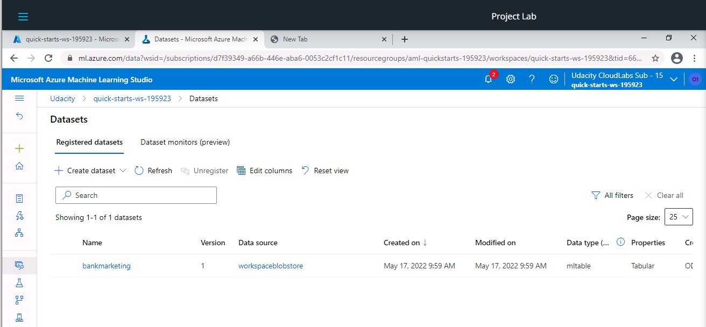
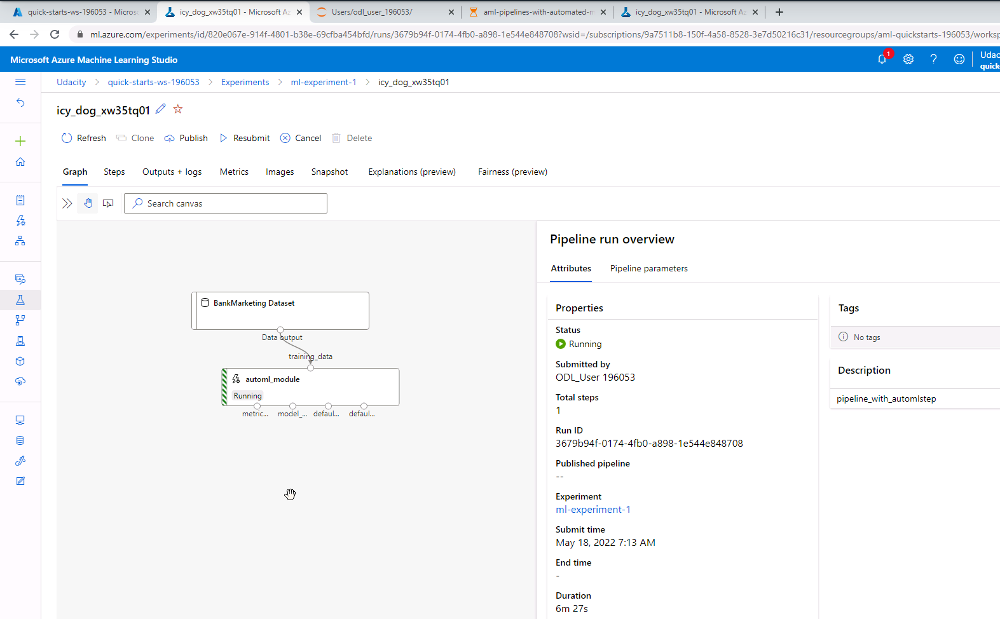

# Machine Learning Engineer with Microsoft Azure Nanodegree

## Project 2 - Operationalizing Machine Learning

The project demonstrates how endpoints in Microsoft Azure can be used to automate machine learning processes and how to use them from other workflows, processes and applications.

## Architectural Diagram

The following diagram shows an overview of the architecture and processes involved in the project.

Most parts of the project are implemented using the ML Azure Python SDK in a notebook for Jupyter. The notebook would usually run in a compute instance that can be created from ML Studio.

In the notebook,

- the dataset for training is first downloaded from the web and registered in a blob storage in Azure,

- a compute cluster is created,

- a pipeline containing an AutoML step with an appropriate configuration is set up and the pipeline is run, producing several trained models together with key performance indicators for each model,

- the best model is chosen based on the area under the curve performance measure and its function is tested on the previously downloaded data,

- the training pipeline is published to a pipeline endpoint "bankmarketing train",

- a run of the pipeline is triggered using an HTTP request to the endpoint. 

The best model found by the AutoML step can also be deployed manually and tested using the `endpoint.py` Python script which constructs two valid inputs, sends them via HTTP to the endpoint and receives corresponding two predictions via a HTTP response.

Not shown in the diagram is that documentation for the endpoint can be generated using Swagger and functionality of the endpoint can further be tested using Apache Benchmark.

**Potential Improvements**

I see some potential for future improvements of the process:

- The best model could be deployed automatically using the Python SDK instead of manual deployment using ML Studio.

- Before deployment, the model might be run on an independent test set and it might only get deployed if it is significantly better than the existing model according to a statistical test.

- Instead of implementing this step as Python code in the notebook itself, it could become a step in the pipeline, such that better models are getting automatically deployed after a re-training.

## Key Steps

Several of the above steps can also be executed manually, as demonstrated in the following.

### Create a new AutoML run

At first the bankmarketing dataset needs to be downloaded from the web and be registered as a dataset in the workspace's blob storage. The above screenshot shows the successful registration of the dataset.

The AutoML run uses the data as training data and has been successfully completed, as  the "Status" column in the screenshot shows.

The best model found by the AutoML step is actually a voting ensemble consisting of a combination of several LightGBM and XGBoost classifiers.

The above screenshot shows other information about the best model, like its accuracy. 

### Deploy a model and consume a model endpoint via an HTTP API

After a model is deployed, it is a good idea to enable Application Insights, as it allows for easy monitoring of the deployed model. To enable it, the `logs.py` script under the `solution` directory has been used. It was adapted to reflect the URL of the model endpoint and API keys.

The above screenshot shows the output of the `logs.py` script.

The above screenshot shows that after running the `logs.py` script, Application Insights is enabled (i.e. shown as "true").

Next, Swagger is used to provide a documentation for the model endpoint's HTTP API. For swagger, the scripts `serve.py` and `swagger.sh` in the `solution/swagger` folder have been used, together with a `swagger.json` file which was downloaded from the model's endpoint swagger URI.

The above screenshot shows that Swagger is running and provides documentation about the API.

With HTTP `GET` requests one can check if the service is up and running (see screenshot above).

With HTTP `POST` requests to the `/score` URL we can send input data for which we want to get predictions (see screenshot above for an example of the data format).

A more detailed and formal description of the input and output formats can be found under "Models" section in the Swagger documentation (see screenshot above).

Based on the documentation, the `endpoint.py` script to be found now in the project's  `solution`folder has been updated, because the one provided was probably outdated, as it did not work. Especially, as the `OrderedMap` entries in the `examples` section in the screenshot above indicate, the dictionary keys now need to be given in exactly the order shown in the screenshot.

The above screenshot shows the output of the updated `endpoint.py` script for the two inputs that were sent to the model's endpoint using an according HTTP request.

The above screenshot shows that we can also use Apache Benchmark to measure the performance of the endpoint. For example, on average a request takes about 217 ms, meaning that about 4.6 requests per second can be handled. These numbers give valuable information about the load which our application might be able to handle and if this meets our requirements.

### Create and publish a pipeline

Once we are sure that training and the resulting best model work, we might publish the training pipeline to an endpoint. For this, the provided Jupyter notebook has been used. It creates a training pipeline for the bankmarketing dataset containing an AutoML step and can then be used to publish this pipeline.

The above screenshot shows that the status of the created pipeline is "Running".

The above screenshot shows more details about the pipeline in which the AutoML step is still running.

### Configure a pipeline with the Python SDK

The pipeline is published to an endpoint called "Bankmarketing Train" as demonstrated in the above screenshot. It's status is now "Active".

### Use a REST endpoint to interact with the Pipeline

As the above screenshot shows, similar to models deployed to an endpoint, we can also get an URL for the pipeline's endpoint REST HTTP API.

Using the endpoint, new runs of the training pipeline can be triggered using simple HTTP requests, as the run that is shown in the above screenshot.

In a Jupyter notebook, we might use a `RunDetails` widget to monitor the status of the pipeline run, as shown in the above screenshot. 

## Screen Recording

The screencast can be found on Vimeo:

[ML Azure Nanodegree - Screencast Project 2](https://vimeo.com/712787453)

## Standout Suggestions

Unfortunately, except for benchmarking the deployed model, due to work obligations I didn't find the time to provide any other optional results. 
